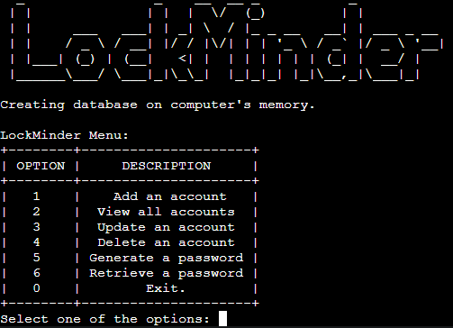

# LockMinder

LockMinder is a user-friendly password manager software that helps you securely store and manage your account credentials. With an intuitive menu-based interface, you can easily add, view, update, and delete accounts in the encrypted SQLite database. LockMinder also offers a password generation tool for creating strong and randomized passwords. Simplify your digital life and keep your passwords safe with LockMinder.

Note: For security purposes on demonstration, LockMinder currently operates with an in-memory database, ensuring that no data is saved outside the application. Please be aware that any added account information will not persist beyond the current session.

## Demo
Experience LockMinder in action by visiting our live demo deployed on Heroku. Simply access the following URL to explore the software's functionality: [LockMinder](https://lockminder-4bcc151d4d1c.herokuapp.com/)

# Contents
* [Technologies Used](#technologies-used)
* [User Experience](#user-experience-ux)
* [Design](#design)
  * [Flowchart](#flowchart)
  * [Existing Features](#existing-features)
  * [Future Implementations](#future-implementations)
* [Deployment](#deployment)
  * [Heroku Deployment](#heroku-deployment)
  * [Run locally](#run-locally)
  * [Create data model and integrate using an API](#create-data-model-and-integrate-using-an-api)
* [Testing](#testing)
* [Credits](#credits)

# Technologies Used
## Language

Python was the chosen language for this project.

## Libraries
 

The "SQLite3" was used as the database management system to securely store and manage account credentials in the project.

 

The "OS" library was used to clear the Python terminal, providing a clean and user-friendly interface for the project.

The "random" library was used for the password generator to create strong and randomized passwords in the project.

The "prettytable" feature was used to format and display tabular data in a visually appealing manner in the project.