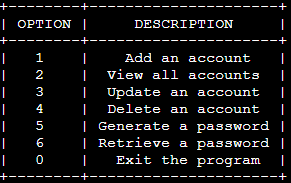
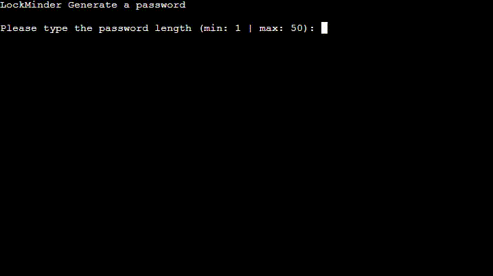
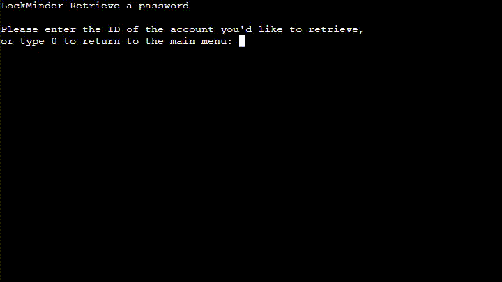

# LockMinder

  

LockMinder is a user-friendly password manager software that helps you securely store and manage your account credentials. With an intuitive menu-based interface, you can easily add, view, update, and delete accounts in the encrypted SQLite database. LockMinder also offers a password generation tool for creating strong and randomized passwords. Simplify your digital life and keep your passwords safe with LockMinder.

## Note
For security purposes on demonstration, LockMinder currently operates with an in-memory database, ensuring that no data is saved outside the application. Please be aware that any added account information will not persist beyond the current session.

As this software is currently running in a cloud environment, it is crucial not to enter real user passwords, accounts, or any sensitive information. The password manager is designed for demonstration purposes and should not be used with actual personal data.

## Demo
Experience LockMinder in action by visiting our live demo deployed on Heroku. Simply access the following URL to explore the software's functionality: [LockMinder](https://lockminder-4bcc151d4d1c.herokuapp.com/)
- - - 
# Contents
* [Technologies Used](#technologies-used)
    * [Language](#language)
    * [Libraries](#libraries)
    * [Frameworks & Tools](#frameworks--tools)
* [User Experience](#user-experience-ux)
* [Design](#design)
  * [Flowchart](#flowchart)
  * [Existing Features](#existing-features)
  * [Future Implementations](#future-implementations)
* [Deployment](#deployment)
  * [Heroku Deployment](#heroku-deployment)
  * [Run locally](#run-locally)
  * [Create data model and integrate using an API](#create-data-model-and-integrate-using-an-api)
* [Testing](#testing)
* [Credits](#credits)
- - - 

# Technologies Used
## Language
* 

Python was the chosen language for this project.

## Libraries
*  

    The "SQLite3" was used as the database management system to securely store and manage account credentials in the project.

*  

    The "OS" library was used to clear the Python terminal, providing a clean and user-friendly interface for the project.

* 

    The "random" library was used for the password generator to create strong and randomized passwords in the project.

* 

    The "prettytable" feature was used to format and display tabular data in a visually appealing manner in the project.

## Frameworks & Tools
* 

    Heroku was used to deploy a live view of the project

* 

    Git was used for version control in the project, enabling efficient tracking of changes.

* 

    GitHub was used as the repository for this project.

For this project a [Code Institute template](https://github.com/Code-Institute-Org/python-essentials-template), was utilized. It provided all the necessary files to run the mock terminal in the browser, facilitating the development process.
- - - 
# User Experience (UX)

## The ideal users for this website is:
* Individuals who are looking for a secure and user-friendly password manager to store and manage their account credentials.

* Users who require a reliable and convenient method to generate strong and randomized passwords for various online services.

## User stories:
* As a user, I want to create an account in the password manager to securely store my login credentials for various online services.

* As a user, I want the password manager to generate strong and unique passwords for accounts to enhance security.

* As a user, I want the ability to view and manage all my stored account credentials in a well-organized and user-friendly interface.

* As a user, I want the option to update or change passwords for my accounts when needed, ensuring my information remains up-to-date.

* As a user, I want the password manager to provide a simple and efficient way to delete accounts that I no longer need.

## How to use:
* Start the Software: When you launch the software, you will be greeted with an ASCII art image and the main menu.

* Main Menu Options: The main menu will present you with the following options:

    * Add an Account: Choose this option to add a new account to the password manager. You will be asked to provide the username, password, and service details.

    * View All Accounts: Select this option to see a list of all the accounts stored in the password manager. The accounts will be displayed in a clear and organized manner.

    * Update an Account: If you need to modify the credentials of an existing account, select this option. You will be prompted to enter the account ID, and then you can update the username, password, or service.
    
    * Delete an Account: To remove an account from the password manager, choose this option. Enter the account ID, and the account will be deleted from the list.

    * Generate a Password: This option allows you to generate a strong and secure password for your accounts. Specify the desired length, and a random password will be created for you.
    
    * Retrieve a Password: Select this option to retrieve the password of a specific account. You will be asked to provide the account ID, and the password will be displayed on the screen.
    
    * Exit: To close the software, choose this option. Your data will be saved securely.
    
* Select an Option: To perform an action, type the corresponding number of the option you want to use. For example, if you want to add a new account, type "1" and press Enter.

* After selecting an option from the main menu, the user will be prompted or presented with clear instructions on how to proceed with the chosen command. This ensures a seamless and user-friendly experience, guiding users through each action in the password manager effectively.

- - -
# Design
Thanks to the template added in the front-end files, users can now interact with this project through a mock terminal displayed on a web page. This interactive terminal provides a user-friendly interface, mimicking the functionality of a real terminal, without requiring any changes to be made in other files. Users can easily navigate and interact with the project's features, making it convenient and accessible for all.

## Existing Features

### Introduction
- Upon running the program, the user is greeted with the LockMinder logo message displayed on the screen. The logo adds a personalized touch to the user experience, enhancing the initial interaction with the password manager.

### Menu
- The menu in this password manager software serves as the main user interface, providing a list of options for interacting with the application. Each option is represented by a number, allowing users to easily select their desired action.

  

### Add an Account
- The "Add an Account" function allows users to add a new account entry to the credentials DB. When users choose this option from the main menu, they are prompted to provide essential details for the new account, such as the username, password, and service.

  

### View All Accounts
- The "View All Accounts" function displays a comprehensive list of all the accounts currently stored in the credentials database. When users select this option from the main menu, the system presents a well-organized table containing the account details, including usernames, passwords, and associated services. This user-friendly display allows users to review and manage their account information efficiently. The function provides quick access to all stored accounts, making it convenient to keep track of login credentials for various services and platforms.

  

### Update an Account
- The "Update an Account" function enables users to modify the credentials of an existing account in the credentials database. Upon selecting this option from the main menu, users are prompted to enter the account ID for the account they wish to update. Once the ID is provided, users can proceed to update the username, password and service associated with the selected account.

  

### Delete an Account
- The "Delete an Account" function allows users to remove an account entry from the credentials database. When users select this option from the main menu, they are prompted to enter the account ID of the account they wish to delete. After providing the account ID, the function proceeds to permanently delete the selected account and its associated details from the password manager.

  

### Generate a Password
- The "Generate a Password" function allows users to create strong and secure passwords for their accounts. Upon selecting this option from the main menu, users are prompted to specify the desired password length. Once the length is provided, the function generates a random password consisting of a mix of characters, including uppercase letters, lowercase letters, digits, and special symbols.

  

### Retrieve a Password
- The "Retrieve a Password" function enables users to access the password and other account details of a specific account stored in the credentials database. When users select this option from the main menu, they are prompted to enter the account ID of the desired account. Once the ID is provided, the function displays the corresponding account's information, including the associated service, username, and password, on the screen, allowing users to retrieve their account credentials with ease.

  

### Exit
- The "Exit" option allows users to gracefully terminate the password manager software. When users select this option from the main menu, the program concludes its execution, and the software closes.

### Data Validators
- The data validators in this password manager software play a crucial role in ensuring the accuracy and integrity of user inputs. These validators are utilized in various functions, such as the "Retrieve a Password," "Update an Account," and others, to validate user-provided data before proceeding with the requested actions.

  

### Potential Enhancements
- While the primary objective of this project is to demonstrate Python knowledge through a Heroku implementation, there are several potential enhancements and additional features that could be implemented in the future to further improve the password manager. Here are some ideas:

    - User Authentication: Introduce master authentication mechanisms, with username and password authentication, to provide a secure login process and protect access to the password manager.

    - Encryption: Implement encryption techniques to securely store passwords and sensitive data in the database, ensuring an added layer of protection.

    - Account Categories: Allow users to categorize their accounts (e.g., personal, work, social media) for better organization and easy navigation.

    - Account Expiry Reminder: Include a feature to set expiration dates for accounts and send reminders to users to update their passwords periodically.

    - Export/Import Functionality: Enable users to export their account data or import credentials from other password managers.

    - Two-Factor Authentication (2FA): Support two-factor authentication to enhance the security of user accounts.

    - GUI Interface: Create a graphical user interface (GUI) for the password manager, offering users a more interactive and visually appealing experience.
- - -
# Deployment
- The code for this project was written using Visual Studio, providing a powerful and user-friendly integrated development environment. To showcase the application's functionality, it has been deployed from GitHub to Heroku. The deployment process involves version releasing, ensuring smooth updates and enhancements to the application. This combination of tools and deployment strategies allows for efficient development and seamless delivery of the password manager to end-users.

## Heroku Deployment
Deployments steps are as follows, after account setup:
* Select New in the top-right corner of your Heroku Dashboard, and select Create new app from the dropdown menu.
* Add a unique app name and then choose a region closest to you (EU or USA).
* Click on Create App.

In order for the project to run on Heroku, Heroku is needed to install the dependencies. 
* In the terminal write the following commando `pip3 freeze > requirements.txt` to create a list of requirements. The list of dependencies will go into `requirements.txt` file.
* Further down, to support dependencies, select Add Buildpack.
* The order of the buildpacks is important, select Python first, then click "Save changes". Then add Node.js second and click "Save changes" again. If they are not in this order, you can drag them to rearrange them.
* Go to "Deploy" and select "GitHub" in "Deployment method".
* To connect Heroku app to your Github repository code enter your repository name, click 'Search' and then 'Connect' when it shows below
* Choose the branch you want to buid your app from.
* If prefered, click on "Enable Automatic Deploys", which keeps the app up to date with your GitHub repository.
* Wait for the app to build. Once ready you will see the “App was successfully deployed” message and a 'View' button to take you to your deployed link.

[GitHub repository](https://github.com/Danvm94/lockminder) 

## Run locally

**Making a Local Clone**
1. Login or Sign Up to GitHub.
2. Open the project [repository](https://github.com/Danvm94/lockminder).
3. Click on the code button, select whether you would like to clone with HTTPS, SSH or GitHub CLI and copy the link shown.
4. Open the terminal in the code editor of your choice and change the current working directory to the location you want to use for the cloned directory.
5. Type 'git clone' into the terminal and then paste the link you copied in step 
6. Press enter.

**Forking the GitHub Repository**
To fork this website to either propose changes or to use as an idea for another website, follow these steps:
1. Login or Sign Up to GitHub.
2. Open the project [repository](https://github.com/Danvm94/lockminder).
3. Click the Fork button in the top right corner.
4. Copy of the repository will be in your own GitHub account.

To deploy from GitHub, follow these steps:

1. Log into your GitHub repository, create a GitHub account if necessary.
2. Click 'Settings' in the main Repository menu.
3. Click 'Pages' from the left-hand side navigation menu.
4. Within the Source section, click the "Branch" button and change from 'None' to 'Main'.
5. The page should automatically refresh with a url displayed.
6. Test the link by clicking on the url.
---
# Testing 
Thorough testing was conducted to ensure all aspects of the application work as intended, providing users with an easy and straightforward experience to achieve their goals.

During the development process, the terminal was extensively utilized to identify and resolve any issues. Various scenarios with correct and incorrect user inputs were tested to ensure the application handles different situations gracefully and provides appropriate feedback to users.

By rigorously testing the application, we can confidently deliver a reliable and robust password manager that meets the needs and expectations of users.

## Functionality
### Manual:
- Add an Account

| Username | Password      | Service | Result | Pass/Fail |
|---------|----------------|---------|--------|-----------|
| Danilo  | m208C!!g0wWk   | Google  | Your account is now added to the credentials list. | Pass      |
| test@email.com  | 8d*16z64BgQN   | E-Mail  | Your account is now added to the credentials list. | Pass      |
| FlamingSwordOfDestiny WillConquerAllChallen gesAndTriumphForever  |    |   | Please use less than 64 characters for username | Pass      |
| Arnold  |  FlamingSwordOfDestiny WillConquerAllChallen gesAndTriumphForever  |   | Please use less than 64 characters for password | Pass      |
| Joseph  |  43%1SwDCBg8%  |  FlamingSwordOfDestiny WillConquerAllChallen gesAndTriumphForever  | Please use less than 64 characters for password | Pass      |

